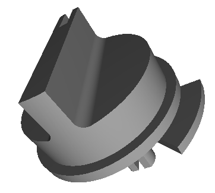

# Junkers Temperaturregler 3D Model

A 3D model for a temperatur adjuster knob on a Junkers TA213 furnace regulator. They break easily (especially their shaft) after 25 years of getting brittle, so I designed a 3D model for one to keep my furnace running for the next 25 years.

The model was created with [OpenSCAD](https://openscad.org/). Feel free to use the `.stl` file to print one for yourself if you are having the same problem with one detriorating.
